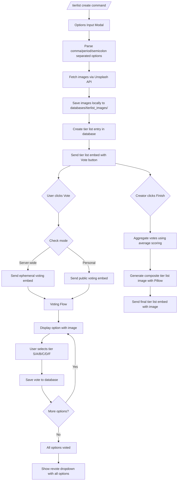

# Tier List System Implementation Plan

## Overview

Create a Discord tier list system with personal and server-wide voting modes, automatic image fetching, persistent interactions, and composite tier list image generation.

## Architecture




## Database Schema

**New database**: `databases/tierlist.db`

### Table: tier_lists

```sql
CREATE TABLE tier_lists (
    list_id INTEGER PRIMARY KEY AUTOINCREMENT,
    guild_id INTEGER NOT NULL,
    creator_id INTEGER NOT NULL,
    list_title TEXT NOT NULL,
    list_mode TEXT NOT NULL, -- 'personal' or 'server'
    status TEXT NOT NULL DEFAULT 'active', -- 'active' or 'finished'
    duration_hours INTEGER DEFAULT 24,
    created_at TEXT NOT NULL,
    expires_at TEXT NOT NULL,
    message_id INTEGER,
    channel_id INTEGER
)
```


### Table: tier_options

```sql
CREATE TABLE tier_options (
    option_id INTEGER PRIMARY KEY AUTOINCREMENT,
    list_id INTEGER NOT NULL,
    option_text TEXT NOT NULL,
    option_index INTEGER NOT NULL,
    image_url TEXT,
    local_image_path TEXT,
    FOREIGN KEY (list_id) REFERENCES tier_lists(list_id)
)
```


### Table: tier_votes

```sql
CREATE TABLE tier_votes (
    vote_id INTEGER PRIMARY KEY AUTOINCREMENT,
    list_id INTEGER NOT NULL,
    option_id INTEGER NOT NULL,
    user_id INTEGER NOT NULL,
    tier_rank TEXT NOT NULL, -- 'S', 'A', 'B', 'C', 'D', 'F'
    tier_score INTEGER NOT NULL, -- S=5, A=4, B=3, C=2, D=1, F=0
    voted_at TEXT NOT NULL,
    UNIQUE(list_id, option_id, user_id),
    FOREIGN KEY (list_id) REFERENCES tier_lists(list_id),
    FOREIGN KEY (option_id) REFERENCES tier_options(option_id)
)
```


### Table: user_voting_progress

```sql
CREATE TABLE user_voting_progress (
    progress_id INTEGER PRIMARY KEY AUTOINCREMENT,
    list_id INTEGER NOT NULL,
    user_id INTEGER NOT NULL,
    current_option_index INTEGER DEFAULT 0,
    is_complete INTEGER DEFAULT 0,
    UNIQUE(list_id, user_id),
    FOREIGN KEY (list_id) REFERENCES tier_lists(list_id)
)
```


## Implementation Structure

### Main Cog: `cogs/production/tierlist.py`

Key components to implement:

#### 1. **Slash Command**

- `/tierlist create` with parameters:
- `title` (string, required) - The title of the tier list
- `mode` (choice: "personal", "server", required)
- `duration_hours` (integer, optional, default=24)
- Command triggers a modal for options input

#### 2. **Options Input Modal**

```python
class TierListOptionsModal(nextcord.ui.Modal):
    # Text input accepting comma, period, and semicolon separated values
    # Parse with regex: r'[,;.]\s*'
    # Limit: 25 options max (Discord's select menu limit)
```


#### 3. **Unsplash API Integration**

- **Helper file**: `utils/unsplash_helper.py`
- Functions:
- `fetch_image_for_term(title_prefix: str, option: str) -> dict`
    - Search query: `f"{title_prefix} {option}"`
    - Returns: `{"url": str, "download_url": str, "description": str}`
- `download_and_save_image(url: str, list_id: int, option_id: int) -> str`
    - Save to: `databases/tierlist_images/{list_id}/{option_id}.jpg`
- **API Key**: Add `UNSPLASH_ACCESS_KEY` to `server_configs/config.py`
- **Rate Limiting**: Track requests, warn if approaching 50/hour limit
- **Fallback**: If image not found or API error, use placeholder or skip image

#### 4. **Persistent Views**

##### Main Tier List View

```python
class TierListMainView(nextcord.ui.View):
    def __init__(self, list_id, creator_id, cog_instance):
        super().__init__(timeout=None)  # Persistent
        # Buttons: "Vote" (custom_id=f"tierlist_vote_{list_id}")
        #          "Finish" (custom_id=f"tierlist_finish_{list_id}", only for creator)
```


##### Voting View

```python
class TierListVotingView(nextcord.ui.View):
    def __init__(self, list_id, user_id, cog_instance):
        super().__init__(timeout=3600)  # 1 hour timeout for voting session
        # Tier dropdown: Select menu with S, A, B, C, D, F
        # Revote dropdown: Select menu with all options (appears after all voted)
        # "Submit Vote" button
        # "Done Voting" button (stops showing ephemeral messages)
```


#### 5. **Voting Flow Logic**

**Server-Wide Mode**:

1. User clicks "Vote" button
2. Bot sends ephemeral message with first unvoted option
3. Shows image embed + tier selection dropdown
4. User selects tier, vote saved, message updates to next option
5. After all options voted, show revote dropdown
6. User can click "Done Voting" to stop receiving messages

**Personal Mode**:

1. Only creator can interact
2. Non-ephemeral messages
3. Same voting flow but publicly visible

**Persistence Strategy**:

- Use `custom_id` with list_id embedded: `f"tierlist_vote_{list_id}"`
- On bot startup, call `add_persistent_views()` method
- Query database for active tier lists and re-add views
- Store `message_id` in database to reattach views to existing messages

#### 6. **Vote Aggregation System**

Tier to score mapping:

```python
TIER_SCORES = {'S': 5, 'A': 4, 'B': 3, 'C': 2, 'D': 1, 'F': 0}
SCORE_TIERS = {5: 'S', 4: 'A', 3: 'B', 2: 'C', 1: 'D', 0: 'F'}
```

Aggregation logic:

1. For each option, get all votes
2. Calculate average score: `sum(vote.tier_score) / count(votes)`
3. Round to nearest integer
4. Map back to tier letter
5. Sort options by average score (descending)

#### 7. **Composite Image Generation**

**File**: `utils/tierlist_image_generator.py`Using Pillow (already in requirements.txt):

```python
async def generate_tierlist_image(list_id: int, aggregated_results: dict) -> str:
    # Image dimensions: 1200px width, variable height
    # Tier row structure:
    #   - Tier label (S, A, B, etc.) - 100px width column
    #   - Images in tier - 150px x 150px thumbnails, multiple per row
    # Colors: S=#FF7F7F (red), A=#FFB27F (orange), B=#FFDF7F (yellow),
    #         C=#BFFF7F (lime), D=#7FFF7F (green), F=#7FBFFF (blue)
    # Return: path to generated image
```

Steps:

1. Create base image with background color
2. For each tier (S through F):

- Draw tier label box with color
- Load and resize option images
- Arrange images horizontally (wrap if needed)
- Add option text below each image

3. Save to `databases/tierlist_images/{list_id}/final_tierlist.png`
4. Return file path

#### 8. **View Persistence on Bot Startup**

In `TierList.__init__()`:

```python
self.bot.loop.create_task(self.add_persistent_views())
```

In `add_persistent_views()` method:

1. Query all active tier lists from database
2. For each, recreate `TierListMainView`
3. Call `bot.add_view(view)` (no message_id needed for custom_id matching)

## Key Files to Create/Modify

### New Files

1. **[cogs/production/tierlist.py](cogs/production/tierlist.py)** - Main cog (~800-1000 lines)
2. **[utils/unsplash_helper.py](utils/unsplash_helper.py)** - Unsplash API integration (~150 lines)
3. **[utils/tierlist_image_generator.py](utils/tierlist_image_generator.py)** - Image composition (~300 lines)
4. **[databases/tierlist.db](databases/tierlist.db)** - SQLite database (auto-created)
5. **databases/tierlist_images/** - Image storage directory (auto-created)

### Modified Files

1. **[server_configs/config.py](server_configs/config.py)** - Add `UNSPLASH_ACCESS_KEY`
2. **[server_configs/database_config.py](server_configs/database_config.py)** - Add `"tierlist": get_db_path("tierlist.db")`

## Command Usage Examples

**Create personal tier list**:

```javascript
/tierlist create title:"Best Marvel Heroes" mode:personal duration_hours:48
[Modal opens with text input for options]
Input: "Iron Man, Spider-Man, Thor, Captain America, Hulk, Black Widow"
```

**Create server-wide tier list**:

```javascript
/tierlist create title:"Top Pizza Toppings" mode:server
[Modal opens]
Input: "Pepperoni; Mushrooms; Olives; Pineapple; Sausage"
```


## Error Handling & Edge Cases

1. **Unsplash API failures**: Log error, use placeholder text "Image unavailable"
2. **Rate limiting**: Track API calls, show warning if approaching limit
3. **No votes on server-wide**: Show "No votes yet" message when finished early
4. **Duplicate options**: Allow duplicates (some tier lists may need them)
5. **Long option names**: Truncate to 100 chars for display
6. **Bot restart during voting**: Voting progress preserved in database
7. **Expired tier lists**: Background task to auto-finish expired lists (check every hour)
8. **Image download failures**: Continue without image, log error
9. **Empty tier ranks**: Skip tier in final image if no options assigned to it
10. **User spam clicking**: Use `interaction.response.is_done()` checks

## Additional Features to Consider

1. **View-only command**: `/tierlist view <list_id>` to see completed tier lists
2. **Delete command**: `/tierlist delete <list_id>` (creator only)
3. **Leaderboard**: `/tierlist leaderboard` showing most popular options across all lists
4. **Export**: Button to get raw CSV/JSON data of votes
5. **Admin controls**: Force finish or delete any tier list

## Tier Score Reference

| Tier | Score | Color (RGB) | Description ||------|-------|-------------|-------------|| S | 5 | #FF7F7F | Outstanding || A | 4 | #FFB27F | Excellent || B | 3 | #FFDF7F | Good || C | 2 | #BFFF7F | Average || D | 1 | #7FFF7F | Below Average || F | 0 | #7FBFFF | Poor |

## Testing Checklist

- [ ] Personal mode voting (creator only)
- [ ] Server-wide mode voting (multiple users)
- [ ] Vote changing/revoting
- [ ] Finish button (creator only)
- [ ] Image fetching and storage
- [ ] Composite image generation
- [ ] View persistence after bot restart
- [ ] Expired tier list auto-finish
- [ ] Modal input parsing (comma, period, semicolon)