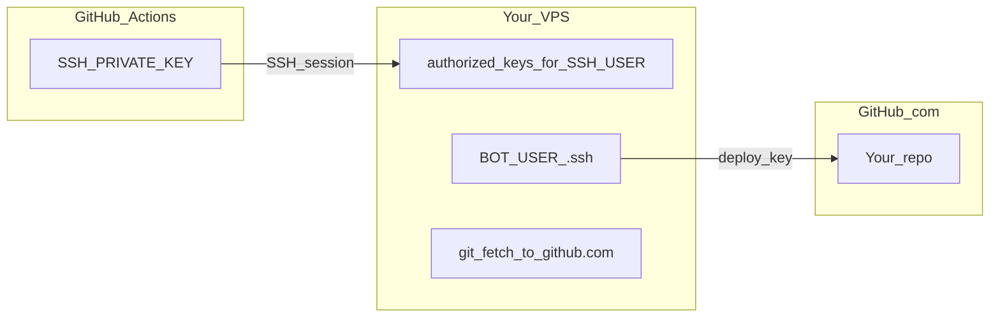

# VPS deployment for GitHub Actions CI/CD

This guide walks through **one full setup** so `[.github/workflows/main.yml](../.github/workflows/main.yml)` can run tests on GitHub, then **SSH into your server**, **pull the repo**, **sync dependencies with uv**, and **restart the bot**. It uses a generic Linux VPS (DigitalOcean droplet, Linode, Hetzner, AWS EC2, etc.)—the steps are the same; only the provider UI for creating the machine differs.

**Related:** For **Docker Compose**, the **standalone ZIP bundle**, and **Postgres migration** workflows (not CI-specific), see **[RUNNING_THE_BOT.md](RUNNING_THE_BOT.md)**.

**Names used below** (replace with yours everywhere: server paths, systemd unit, workflow):


| Placeholder    | Example in this repo                                                                    |
| -------------- | --------------------------------------------------------------------------------------- |
| `BOT_USER`     | `discord_bot`                                                                           |
| `REPO_PATH`    | `/home/discord_bot` (git working tree at `BOT_USER`’s home; same directory as `~/.ssh`) |
| `SERVICE_NAME` | `discord_bot` (systemd unit is often `discord_bot.service`)                             |


Edit the deploy **script** in `.github/workflows/main.yml` if your paths or user differ.

**Legacy setups** used a separate checkout at `/home/discord_bot_v2` so the bot could keep running during CI/Doppler migration. New installs use `**/home/discord_bot`** as both `BOT_USER`’s home and the git root; the workflow matches that layout.

---

## How the pieces fit together (read this once)

You need **two different SSH keys** for two different connections:

1. **CI deploy key (GitHub Actions → your VPS)**
  - Private key stored in GitHub secret `SSH_PRIVATE_KEY`.  
  - Public key in `**~/.ssh/authorized_keys` on the VPS** for whichever account you set as `SSH_USER` (often `root`).  
  - Purpose: let the workflow open an SSH session to run shell commands.
2. **Git deploy key (VPS → GitHub.com)**
  - Key pair lives **on the server** under `**BOT_USER`** (e.g. `/home/discord_bot/.ssh/`).  
  - Public key added in **GitHub → your repository → Settings → Deploy keys** (read access is enough for `git fetch`).  
  - Purpose: let `sudo -u BOT_USER git fetch` authenticate to `git@github.com`.  
  - This is **not** the same key as `SSH_PRIVATE_KEY`. The Actions key never leaves GitHub’s runner except to SSH to your box; it does not authenticate to GitHub for `git`.




---

## 1. Create the VPS and log in

1. Create a small Ubuntu (or Debian) instance with a public IP and SSH allowed on port 22 (or your chosen port).
2. SSH in as root or the provider’s default user with the provider’s console or your own key.
3. Create `BOT_USER` if you want the bot to run as a non-root account (strongly recommended):
  ```bash
   adduser --disabled-password --gecos "" discord_bot
  ```
   (Adjust `discord_bot` to your `BOT_USER`.)
4. Install base packages:
  ```bash
   apt update && apt install -y git curl
  ```

---

## 2. Install `uv` for `BOT_USER`

`uv` should be available where your deploy script calls it (this repo uses `/home/discord_bot/.local/bin/uv`).

```bash
sudo -u discord_bot bash -c 'curl -LsSf https://astral.sh/uv/install.sh | sh'
```

Confirm:

```bash
sudo -u discord_bot ~/.local/bin/uv --version
```

If you change install location, update the path in `.github/workflows/main.yml`.

---

## 3. Check out the repository as `BOT_USER`

Use the **same** `REPO_PATH` as in the workflow: `**/home/discord_bot`** (repo root is `BOT_USER`’s home so paths match `scripts/run_bot.sh` and CI).

`adduser` usually leaves dotfiles (`.bashrc`, etc.) in `/home/discord_bot`, so `**git clone … /home/discord_bot` will fail** (“destination path already exists and is not an empty directory”). Use **either** approach below.

### 3a. Fresh home (rare): empty directory

If `/home/discord_bot` is empty except what you need:

```bash
sudo chown discord_bot:discord_bot /home/discord_bot
sudo -u discord_bot git clone git@github.com:OWNER/REPO.git /home/discord_bot
```

### 3b. Normal case: home already has `.ssh` and profile files (recommended)

Set up the **Git deploy key** (section 6) first, then:

```bash
sudo chown discord_bot:discord_bot /home/discord_bot
sudo -u discord_bot bash -c 'cd /home/discord_bot && git init && git remote add origin git@github.com:OWNER/REPO.git && git fetch origin && git checkout -b main origin/main'
```

If your default branch is not `main`, replace `main` / `origin/main` with your branch name.

Typical **SSH** remote after setup:

```bash
sudo -u discord_bot git -C /home/discord_bot remote -v
# expect: git@github.com:OWNER/REPO.git
```

---

## 4. Doppler and systemd (runtime secrets)

The bot reads env from Doppler (or your chosen method). On the server:

1. Install/configure Doppler CLI. Prefer a **service token** (`dp.st…`) scoped to your production config; see [Doppler service tokens](https://docs.doppler.com/docs/service-tokens).
2. Install the unit below as e.g. `**/etc/systemd/system/discord_bot.service`**, then:
  ```bash
   sudo systemctl daemon-reload
   sudo systemctl enable --now discord_bot
  ```
3. Confirm: `**journalctl -u discord_bot -e**` and `**tail -f**` the combined runtime log (set `**BOT_LOG_FILE**` in Doppler/unit env — e.g. `**/home/discord_bot/logs/discord_bot.log**` if you adopted the same layout as Docker, or `**/home/discord_bot/Discord-Bot-Sandbox/logs/discord_bot.log**` for a repo clone default). If Doppler errors mention the wrong project, fix `**doppler.yaml**` / `doppler configure` under `/home/discord_bot` (see Doppler CLI docs for `configure set project`).

**Example unit** (runs `[scripts/run_bot.sh --doppler](../scripts/run_bot.sh)` from the repo root; aligns with `[.github/workflows/main.yml](../.github/workflows/main.yml)` `systemctl restart discord_bot`):

```ini
[Unit]
Description=Discord Bot [UV]
After=network.target

[Service]
Type=simple
TimeoutStopSec=30
User=discord_bot
Group=discord_bot
WorkingDirectory=/home/discord_bot
Environment=PYTHONUNBUFFERED=1
# Use your real service token from Doppler (never commit it to git).
Environment=DOPPLER_TOKEN=dp.st.prd.REPLACE_ME
# Include .local/bin so uv and project tools resolve.
Environment=PATH=/usr/local/sbin:/usr/local/bin:/usr/sbin:/usr/bin:/sbin:/bin:/home/discord_bot/.local/bin
ExecStart=/bin/bash /home/discord_bot/scripts/run_bot.sh --doppler
Restart=always
RestartSec=10

[Install]
WantedBy=multi-user.target
```

**Notes:**

- `**PYTHONUNBUFFERED=1`** — Makes `**boot_print`** / `**print**` lines show up in `**journalctl**` without long delays when mirrored to stdout (`**APP_LOG_STDOUT_MIRROR**`); Nextcord writes to the same **combined rotating file** as `**main_bot`** (see `**BOT_LOG_FILE`** / `main_bot/main.py`).
- `**PATH**` — Must end with `**…/discord_bot/.local/bin**` (your draft ended with `**/.local/**` — that is too broad and can miss `uv`; use `**bin**`). If commands still fail to resolve, add `Environment=HOME=/home/discord_bot`.
- **Secrets in the unit file** — Default permissions can leave tokens readable; use `**chmod 600`** on the unit if you keep the token inline, or prefer `**EnvironmentFile=/etc/discord_bot/doppler.env`** with `DOPPLER_TOKEN=…` inside (mode `600`, root-owned) and remove the inline `DOPPLER_TOKEN` line.
- **Quoting** — `Environment=KEY=value` is enough for tokens without spaces; quoted `Environment="KEY=val"` is also fine.

### Lavalink (optional — music cog)

If you use `/music` on the VPS without Docker Compose, run Lavalink as a second systemd unit on the same host. One-time layout (as `root`):

1. Install Java 21+ (`apt install -y openjdk-21-jre-headless` or your distro’s package).
2. Create `/home/lavalink`, download the [Lavalink server JAR](https://github.com/lavalink-devs/Lavalink/releases) as `Lavalink.jar`, and copy `application.yml` from this repo’s `lavalink/application.yml.example` (edit `lavalink.server.password` and plugins).
3. `chown -R discord_bot:discord_bot /home/lavalink`
4. In Doppler (or your bot env), set `LAVALINK_URI=http://127.0.0.1:2333` and `LAVALINK_PASSWORD` to the same value as in `application.yml` (see `[DOPPLER_ENV_KEYS.md](DOPPLER_ENV_KEYS.md)`).

Install the unit as `**/etc/systemd/system/lavalink.service`**, then:

```bash
sudo systemctl daemon-reload
sudo systemctl enable --now lavalink
```

Confirm: `**journalctl -u lavalink -e**`. Optional: set `**BOT_LOG_JOURNAL_EXTRA_UNITS=lavalink**` in Doppler so the `**.logging**` admin command can tail this unit alongside the bot.

**Example unit** (runs the JAR as `BOT_USER`; adjust `-Xmx` and paths if you use a different layout):

```ini
[Unit]
Description=Lavalink audio server
After=network-online.target
Wants=network-online.target

[Service]
Type=simple
User=discord_bot
Group=discord_bot
WorkingDirectory=/home/lavalink
ExecStart=/usr/bin/java -Xmx4G -jar /home/lavalink/Lavalink.jar
Restart=on-failure
RestartSec=5
SyslogIdentifier=lavalink

[Install]
WantedBy=multi-user.target
```

If you still use an older unit name (e.g. `**discord_bot_v2.service`**), either rename the unit to `**discord_bot`** or change the `systemctl restart …` line in `.github/workflows/main.yml` to match. Update `**BOT_LOG_JOURNAL_UNIT**` in Doppler if you use the `**.logging**` admin command (see `[DOPPLER_ENV_KEYS.md](DOPPLER_ENV_KEYS.md)`).

---

## 5. Key A — SSH from GitHub Actions into the VPS (CI deploy key)

### 5.1 Generate a dedicated key pair **on your laptop** (do not reuse a personal key)

```bash
ssh-keygen -t ed25519 -f ./gha_vps_deploy -N ""
```

You get `gha_vps_deploy` (private) and `gha_vps_deploy.pub` (public).

### 5.2 Install the **public** key on the VPS for `**SSH_USER`**

- If `**SSH_USER` is `root`**:
  ```bash
  mkdir -p /root/.ssh
  chmod 700 /root/.ssh
  echo "CONTENTS_OF_gha_vps_deploy.pub" >> /root/.ssh/authorized_keys
  chmod 600 /root/.ssh/authorized_keys
  ```
- If `**SSH_USER` is `BOT_USER**`, use `/home/discord_bot/.ssh/authorized_keys` instead.

The **same** public key must not be confused with the Git deploy key in section 6—they are different key pairs.

### 5.3 Put the **private** key in GitHub

1. Repo → **Settings → Secrets and variables → Actions → New repository secret**
2. Name: `SSH_PRIVATE_KEY`
3. Value: paste the **entire** contents of `gha_vps_deploy` (including `BEGIN`/`END` lines).
  - **Do not** add extra quotation marks around the whole key.  
  - Use real newlines (multiline paste is supported).

### 5.4 Other Action secrets


| Secret     | Value                                                     |
| ---------- | --------------------------------------------------------- |
| `SSH_HOST` | VPS public IP or DNS name                                 |
| `SSH_USER` | Account whose `authorized_keys` you updated (e.g. `root`) |


Optional repository **variable**: `SSH_PORT` if SSH is not on 22.

### 5.5 Test from your laptop (same key GitHub will use)

```bash
ssh -i ./gha_vps_deploy -o IdentitiesOnly=yes root@YOUR_VPS_IP
```

If this fails, fix `authorized_keys` before relying on Actions.

---

## 6. Key B — `git fetch` from the VPS to GitHub (Git deploy key)

The workflow runs commands like `sudo -u BOT_USER git fetch`. That uses `**BOT_USER`’s** `~/.ssh/`, not root’s.

### 6.1 Create a key **on the VPS** as `BOT_USER`

```bash
sudo -u discord_bot mkdir -p /home/discord_bot/.ssh
sudo -u discord_bot chmod 700 /home/discord_bot/.ssh
sudo -u discord_bot ssh-keygen -t ed25519 -f /home/discord_bot/.ssh/github_discord_bot -N ""
sudo cat /home/discord_bot/.ssh/github_discord_bot.pub
```

### 6.2 Add the deploy key in GitHub

1. Open **that same repository** your `origin` points to (e.g. `OWNER/REPO`).
2. **Settings → Deploy keys → Add deploy key**
3. Title: e.g. `vps-readonly`
4. Key: paste the `**.pub`** line
5. Enable **Allow read access** (sufficient for `fetch` / `reset`)

### 6.3 Force SSH to use that key for `github.com`

Without this, OpenSSH looks for default `id_rsa` / `id_ed25519` and may find nothing.

```bash
sudo -u discord_bot tee /home/discord_bot/.ssh/config >/dev/null <<'EOF'
Host github.com
  HostName github.com
  User git
  IdentityFile ~/.ssh/github_discord_bot
  IdentitiesOnly yes
EOF
sudo chmod 600 /home/discord_bot/.ssh/config
sudo chown discord_bot:discord_bot /home/discord_bot/.ssh/config
```

### 6.4 Trust GitHub’s host key (recommended on the server)

```bash
sudo -u discord_bot ssh-keyscan -H github.com >> /home/discord_bot/.ssh/known_hosts
sudo chown discord_bot:discord_bot /home/discord_bot/.ssh/known_hosts
```

The workflow also sets `GIT_SSH_COMMAND` with `StrictHostKeyChecking=accept-new` for `git` so the first connection can succeed even before `known_hosts` exists; pinning `github.com` on the server is still good practice.

### 6.5 Verify

```bash
sudo -u discord_bot ssh -T git@github.com
# expect: successfully authenticated …

sudo -u discord_bot git -C /home/discord_bot fetch origin
```

---

## 7. `sudo` for deploy: `git` / `uv` as `BOT_USER`, restart as root

The example workflow SSHs as `**root**` (typical when Key A is in `/root/.ssh/authorized_keys`). Then:

- `**sudo -u discord_bot git …**` and `**sudo -u discord_bot … uv …**` keep the repo owned by `BOT_USER`.
- `**systemctl restart SERVICE_NAME**` runs as root without `sudo`.

If you SSH as `BOT_USER` instead, you need passwordless `sudo` for `systemctl` (narrow sudoers rule) or run the service as `BOT_USER` without `systemctl` (not covered here).

Example **sudoers** snippet (edit with `visudo`), only if needed:

```text
discord_bot ALL=(ALL) NOPASSWD: /bin/systemctl restart discord_bot
```

---

## 8. Align `.github/workflows/main.yml` with your server

Open `[.github/workflows/main.yml](../.github/workflows/main.yml)` and check the **deploy** job `script:` block:


| What to verify                | Your value                |
| ----------------------------- | ------------------------- |
| `cd …` and `git` / `uv` paths | Must match `REPO_PATH`    |
| `sudo -u …`                   | Must match `BOT_USER`     |
| `uv` binary path              | Must exist on the server  |
| `systemctl restart …`         | Must match your unit name |


This repo does **not** use repository variables `DEPLOY_PATH` / `SYSTEMD_SERVICE` in the workflow file; paths are **inline**. Change them here when you move providers or rename users.

---

## 9. `appleboy/ssh-action` notes (version 1.2.x)

- Valid inputs include `host`, `port`, `username`, `key`, `script`.  
- `**known_hosts` is not a valid input** for this version—GitHub Actions would warn and ignore it.  
- Optional **host pinning** for the **VPS** uses `fingerprint` (SHA256 of the server host key), not a full `known_hosts` blob. Only add if you wire `fingerprint:` in the workflow and a matching secret.

---

## 10. Troubleshooting quick reference


| Symptom                                                                          | Likely cause                                                                                                                       |
| -------------------------------------------------------------------------------- | ---------------------------------------------------------------------------------------------------------------------------------- |
| `unable to authenticate` / `no supported methods remain` (Actions → VPS)         | Wrong `SSH_USER`; public key not in **that** user’s `authorized_keys`; or private key in GitHub truncated / wrong / has passphrase |
| `Host key verification failed` for **github.com** during `git fetch`             | `BOT_USER` missing `github.com` in `known_hosts`; workflow mitigates with `accept-new`                                             |
| `Permission denied (publickey)` from **[git@github.com](mailto:git@github.com)** | No Git deploy key, or not added under **Repo → Deploy keys**, or missing `~/.ssh/config` `IdentityFile`                            |
| `Hi …! You've successfully authenticated` but `git fetch` still fails            | Rare; check `origin` URL and repo name (fork vs upstream)                                                                          |


**Diagnostic commands** (run on VPS as root; adjust paths):

```bash
REPO=/home/discord_bot
sudo -u discord_bot git -C "$REPO" remote -v
sudo ls -la /home/discord_bot/.ssh/
sudo -u discord_bot ssh -o BatchMode=yes -T git@github.com
```

---

## 11. CI tests and Doppler on GitHub (optional)

If secret `DOPPLER_TOKEN` is set, the test job runs `doppler run -- uv run pytest`. Otherwise set placeholder env vars in the workflow (as in `main.yml`) or add a Doppler CI config and token per Doppler’s docs.

---

## 12. Checklist (new provider / new server)

Use this when you rebuild the VPS or switch cloud:

- VPS created; firewall allows SSH (and bot ports if needed)
- `BOT_USER` created; repo cloned at `REPO_PATH`
- `uv` installed for `BOT_USER`; systemd + Doppler + bot runs manually
- **Key A:** CI key pair; public in `SSH_USER`’s `authorized_keys`; private in `SSH_PRIVATE_KEY`; `SSH_HOST`, `SSH_USER` set
- **Key B:** `BOT_USER` deploy key; public in GitHub **Deploy keys**; `~/.ssh/config` with `IdentityFile`; `known_hosts` for `github.com` (optional with workflow `accept-new`)
- Local test: `ssh -i ci_private_key SSH_USER@SSH_HOST` and `sudo -u BOT_USER git fetch` both succeed
- `.github/workflows/main.yml` deploy script paths and `systemctl` name updated
- Push to `main` and confirm Actions: test job green, deploy job green

---

## Related files

- `[.github/workflows/main.yml](../.github/workflows/main.yml)` — CI + deploy commands  
- `[scripts/run_bot.sh](../scripts/run_bot.sh)` — `uv run python -m main_bot` with `**--doppler`** or `**--env`**, optional `**--dir**`

