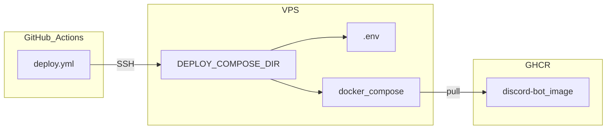

# VPS deploy

This document describes how to run the bot on a remote Linux host with Docker Compose. GitHub Actions can pull new images and restart the stack after a release.

For the first-time file layout, see [QUICKSTART.md](QUICKSTART.md). For host Python without Docker, see [BARE_METAL.md](BARE_METAL.md).

## Architecture




The deploy workflow SSHs into the host. It runs `docker compose down` and then `docker compose up -d --pull always` in `DEPLOY_COMPOSE_DIR`. Secrets stay in the host `.env` file.

## Placeholders


| Placeholder  | Example                 |
| ------------ | ----------------------- |
| `BOT_USER`   | `discord_bot`           |
| `DEPLOY_DIR` | `/home/discord_bot`     |
| `SSH_USER`   | `root` or `discord_bot` |


## 1. Create the host

1. Create an Ubuntu or Debian instance with a public IP.
2. Allow SSH on port 22 (or your chosen port).
3. Log in as root or the provider default user.
4. Create a non-root user for the bot.

```bash
adduser --disabled-password --gecos "" discord_bot
```

1. Install Docker Engine and the Compose plugin. Follow the Docker install guide for your distribution.
2. Add `BOT_USER` to the `docker` group.

```bash
usermod -aG docker discord_bot
```


## 2. Install the compose project

1. Create the deploy directory.
2. Run the install script as `BOT_USER`.

```bash
sudo -u discord_bot bash -c 'mkdir -p /home/discord_bot && cd /home/discord_bot && curl -fsSL https://raw.githubusercontent.com/JJ3571/L.I.L.I.T.H./main/scripts/install.sh | bash'
```

You can also copy `docker-compose.yml`, `.env.example`, and `lavalink/application.yml.example` by hand.

1. Edit `/home/discord_bot/.env`.
2. Set `DISCORD_BOT_TOKEN`, `APPLICATION_ID`, and `GUILD_ID`.
3. Leave `DATABASE_URL` empty for the bundled Postgres default.
4. Copy the Lavalink template if the install script did not create it.

```bash
cp /home/discord_bot/lavalink/application.yml.example /home/discord_bot/lavalink/application.yml
```


## 3. Start the stack

1. Change to the deploy directory.
2. Run the doctor check.
3. Start the services.

```bash
cd /home/discord_bot
./scripts/bot.sh doctor
./scripts/bot.sh up
./scripts/bot.sh status
```

1. Confirm the bot appears online in Discord.


## 4. Configure GitHub Actions deploy

The workflow file is `[.github/workflows/deploy.yml](../.github/workflows/deploy.yml)`. It runs on `workflow_dispatch` and after a successful Release workflow. If you've made it this far, you'll see that the default deploy is modified to use Doppler (as is my preferred way). You can comment/uncomment these lines to match your usecase.

### Repository secrets


| Secret            | Purpose                    |
| ----------------- | -------------------------- |
| `SSH_HOST`        | VPS hostname or IP         |
| `SSH_USER`        | SSH login user             |
| `SSH_PRIVATE_KEY` | Private key for that login |


### Repository variables


| Variable             | Purpose                                                           |
| -------------------- | ----------------------------------------------------------------- |
| `DEPLOY_COMPOSE_DIR` | Absolute path to the compose project. Default `/home/discord_bot` |
| `SSH_PORT`           | SSH port. Default `22`                                            |


### SSH key for Actions

1. Generate a dedicated key pair for CI.
2. Add the public key to `authorized_keys` for `SSH_USER` on the VPS.
3. Store the private key in GitHub secret `SSH_PRIVATE_KEY`.

This key opens an SSH session to the VPS. It does not authenticate to GitHub for `git`.

### GHCR pull access

The compose file pulls `ghcr.io/jj3571/discord-bot:latest`. If the package is private, log in on the VPS once.

```bash
echo "$GITHUB_TOKEN" | docker login ghcr.io -u USERNAME --password-stdin
```

Use a token with `read:packages` scope.

## 5. Trigger a deploy

1. Create a release tag with `./scripts/tag_release.sh`, or push a `vX.Y.Z` tag.
2. The Release workflow builds and pushes the multi-arch image to GHCR.
3. The Deploy workflow SSHs to the VPS and recreates containers with `--pull always`.

You can also run the Deploy workflow manually from the Actions tab.

## Troubleshooting


| Symptom             | Check                                                                       |
| ------------------- | --------------------------------------------------------------------------- |
| Workflow cannot SSH | Confirm `SSH_HOST`, `SSH_USER`, `SSH_PRIVATE_KEY`, and `SSH_PORT`           |
| No compose file     | Confirm `DEPLOY_COMPOSE_DIR` holds `docker-compose.yml`                     |
| Image pull denied   | Log in to GHCR on the VPS                                                   |
| Bot offline         | Run `./scripts/bot.sh logs` and `./scripts/bot.sh doctor`                   |
| Database errors     | Confirm `COMPOSE_PROFILES` and `DATABASE_URL` in [DATABASE.md](DATABASE.md) |


## Related workflows


| Workflow      | Role                                                       |
| ------------- | ---------------------------------------------------------- |
| `ci.yml`      | Run tests with a Postgres service                          |
| `release.yml` | Build and push the Docker image. Create the GitHub Release |
| `deploy.yml`  | SSH deploy with Docker Compose                             |


